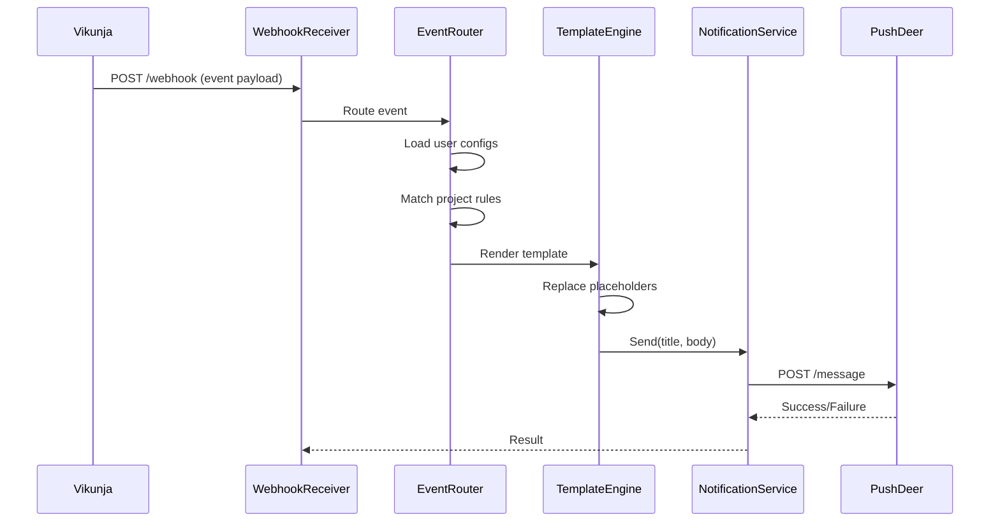

# Design Document

## Overview

本设计文档描述了 Vikunja Webhook 通知系统的技术架构和实现方案。系统采用可扩展的插件式架构，支持多种通知提供者（如 PushDeer），通过 Vue3 + TypeScript + Vuestic 构建的 Web 界面让用户自主配置项目级别的通知规则和自定义通知模板。系统使用 JSON 文件存储用户配置，复用现有 MCP 工具接口，并完全支持 .NET AOT 编译。

## Architecture

### High-Level Architecture

系统采用分层架构，包含以下主要层次：

```
┌─────────────────────────────────────────────────────────────┐
│                    Web UI (Vue3 + Vuestic)                  │
│  - Configuration Management  - Template Editor              │
│  - Provider Setup           - Event Toggles                 │
└─────────────────────────────────────────────────────────────┘
                              │ HTTP/REST API
┌─────────────────────────────────────────────────────────────┐
│                    ASP.NET Core Web API                     │
│  - Configuration API        - Webhook Receiver              │
│  - Backup/Restore API       - Test Notification API        │
└─────────────────────────────────────────────────────────────┘
                              │
┌─────────────────────────────────────────────────────────────┐
│                    Core Business Logic                      │
│  - Notification Service     - Template Engine               │
│  - Provider Registry        - Event Router                  │
│  - Configuration Manager    - MCP Integration               │
└─────────────────────────────────────────────────────────────┘
                              │
┌─────────────────────────────────────────────────────────────┐
│                    Data & External Services                 │
│  - JSON File Storage        - PushDeer API                  │
│  - MCP Tools (Reused)       - Other Providers               │
└─────────────────────────────────────────────────────────────┘
```

### Component Interaction Flow



## Components and Interfaces

### 1. Notification Provider Interface

所有通知提供者必须实现的核心接口：

```csharp
public interface INotificationProvider
{
    string ProviderType { get; }
    
    Task<NotificationResult> SendAsync(
        NotificationMessage message, 
        CancellationToken cancellationToken = default);
    
    Task<ValidationResult> ValidateConfigAsync(
        ProviderConfig config, 
        CancellationToken cancellationToken = default);
}

public record NotificationMessage(
    string Title,
    string Body,
    NotificationFormat Format = NotificationFormat.Text);

public enum NotificationFormat
{
    Text,
    Markdown,
    Html
}

public record NotificationResult(
    bool Success,
    string? ErrorMessage = null,
    DateTime Timestamp = default);

public record ProviderConfig(
    string ProviderType,
    Dictionary<string, string> Settings);
```

### 2. PushDeer Provider Implementation

```csharp
public class PushDeerProvider : INotificationProvider
{
    private readonly HttpClient _httpClient;
    private readonly ILogger<PushDeerProvider> _logger;
    
    public string ProviderType => "pushdeer";
    
    public async Task<NotificationResult> SendAsync(
        NotificationMessage message, 
        CancellationToken cancellationToken)
    {
        // Implementation with retry logic (up to 3 attempts)
        // Supports both text and markdown formats
    }
    
    public async Task<ValidationResult> ValidateConfigAsync(
        ProviderConfig config, 
        CancellationToken cancellationToken)
    {
        // Validate API key by making a test request
    }
}
```

### 3. Template Engine

负责处理占位符替换的模板引擎：

```csharp
public interface ITemplateEngine
{
    string Render(string template, TemplateContext context);
    IReadOnlyList<string> GetAvailablePlaceholders(string eventType);
}

public class TemplateContext
{
    public TaskData? Task { get; init; }
    public ProjectData? Project { get; init; }
    public UserData? User { get; init; }
    public EventData Event { get; init; }
    public IReadOnlyList<string>? Assignees { get; init; }
    public IReadOnlyList<string>? Labels { get; init; }
}

public class SimpleTemplateEngine : ITemplateEngine
{
    // Uses regex-based placeholder replacement
    // Pattern: {{property.name}}
    // AOT-compatible implementation without reflection
}
```

### 4. Configuration Manager

管理用户配置的读写和验证：

```csharp
public interface IConfigurationManager
{
    Task<UserConfig?> LoadUserConfigAsync(
        string userId, 
        CancellationToken cancellationToken = default);
    
    Task SaveUserConfigAsync(
        UserConfig config, 
        CancellationToken cancellationToken = default);
    
    Task<IReadOnlyList<UserConfig>> LoadAllConfigsAsync(
        CancellationToken cancellationToken = default);
    
    Task<byte[]> ExportConfigsAsync(
        IEnumerable<string> userIds, 
        CancellationToken cancellationToken = default);
    
    Task ImportConfigsAsync(
        byte[] zipData, 
        CancellationToken cancellationToken = default);
}

public class JsonFileConfigurationManager : IConfigurationManager
{
    // Stores configs in: /data/configs/{userId}.json
    // Uses atomic writes with temp files
    // AOT-compatible with source-generated JSON serialization
}
```

### 5. Event Router

路由 webhook 事件到匹配的用户配置：

```csharp
public interface IEventRouter
{
    Task RouteEventAsync(
        WebhookEvent webhookEvent, 
        CancellationToken cancellationToken = default);
}

public class EventRouter : IEventRouter
{
    private readonly IConfigurationManager _configManager;
    private readonly ITemplateEngine _templateEngine;
    private readonly INotificationService _notificationService;
    private readonly IMcpToolsAdapter _mcpTools;
    
    public async Task RouteEventAsync(
        WebhookEvent webhookEvent, 
        CancellationToken cancellationToken)
    {
        // 1. Load all user configs
        // 2. Filter configs matching project and event type
        // 3. Enrich event data using MCP tools
        // 4. Render templates
        // 5. Send notifications asynchronously
    }
}
```

### 6. MCP Tools Adapter

适配器模式复用现有 MCP 工具：

```csharp
public interface IMcpToolsAdapter
{
    Task<ProjectData?> GetProjectAsync(
        int projectId, 
        CancellationToken cancellationToken = default);
    
    Task<TaskData?> GetTaskAsync(
        int taskId, 
        CancellationToken cancellationToken = default);
    
    Task<UserData?> GetUserAsync(
        int userId, 
        CancellationToken cancellationToken = default);
    
    Task<IReadOnlyList<string>> GetTaskAssigneesAsync(
        int taskId, 
        CancellationToken cancellationToken = default);
    
    Task<IReadOnlyList<string>> GetTaskLabelsAsync(
        int taskId, 
        CancellationToken cancellationToken = default);
}

public class McpToolsAdapter : IMcpToolsAdapter
{
    // Wraps existing MCP tools:
    // - ProjectsTools
    // - TasksTools
    // - UsersTools
    // - TaskAssigneesTools
    // - TaskLabelsTools
}
```

### 7. Web API Controllers

```csharp
[ApiController]
[Route("api/webhook-config")]
public class WebhookConfigController : ControllerBase
{
    [HttpGet("{userId}")]
    public Task<UserConfig> GetConfig(string userId);
    
    [HttpPut("{userId}")]
    public Task UpdateConfig(string userId, UserConfig config);
    
    [HttpPost("{userId}/test")]
    public Task<NotificationResult> TestNotification(
        string userId, 
        TestNotificationRequest request);
    
    [HttpPost("export")]
    public Task<FileResult> ExportConfigs(ExportRequest request);
    
    [HttpPost("import")]
    public Task<ImportResult> ImportConfigs(IFormFile file);
}

[ApiController]
[Route("api/webhook")]
public class WebhookReceiverController : ControllerBase
{
    [HttpPost]
    public Task<IActionResult> ReceiveWebhook(
        [FromBody] WebhookEvent webhookEvent);
}
```

## Data Models

### User Configuration Model

```csharp
public class UserConfig
{
    public string UserId { get; set; } = string.Empty;
    public List<ProviderConfig> Providers { get; set; } = new();
    public List<ProjectRule> ProjectRules { get; set; } = new();
    public Dictionary<string, NotificationTemplate> Templates { get; set; } = new();
    public DateTime LastModified { get; set; }
}

public class ProjectRule
{
    public string ProjectId { get; set; } = "*"; // "*" for all projects
    public List<string> EnabledEvents { get; set; } = new();
    public string? ProviderType { get; set; } // null = use all providers
}

public class NotificationTemplate
{
    public string EventType { get; set; } = string.Empty;
    public string Title { get; set; } = string.Empty;
    public string Body { get; set; } = string.Empty;
    public NotificationFormat Format { get; set; } = NotificationFormat.Text;
}
```

### Webhook Event Model

```csharp
public class WebhookEvent
{
    public string EventType { get; set; } = string.Empty;
    public DateTime Timestamp { get; set; }
    public int ProjectId { get; set; }
    public TaskEventData? Task { get; set; }
    public ProjectEventData? Project { get; set; }
    public CommentEventData? Comment { get; set; }
    public AttachmentEventData? Attachment { get; set; }
    public RelationEventData? Relation { get; set; }
    public TeamEventData? Team { get; set; }
}
```

### Default Templates

系统为每种事件类型提供默认模板：

```csharp
public static class DefaultTemplates
{
    public static readonly Dictionary<string, NotificationTemplate> Templates = new()
    {
        ["task.created"] = new()
        {
            EventType = "task.created",
            Title = "New Task: {{task.title}}",
            Body = "A new task has been created in {{project.title}}\n\nDescription: {{task.description}}",
            Format = NotificationFormat.Text
        },
        ["task.updated"] = new()
        {
            EventType = "task.updated",
            Title = "Task Updated: {{task.title}}",
            Body = "Task in {{project.title}} has been updated",
            Format = NotificationFormat.Text
        },
        // ... templates for all 16 event types
    };
}
```

### JSON Serialization Context (AOT Support)

```csharp
[JsonSourceGenerationOptions(
    WriteIndented = true,
    PropertyNamingPolicy = JsonKnownNamingPolicy.CamelCase)]
[JsonSerializable(typeof(UserConfig))]
[JsonSerializable(typeof(WebhookEvent))]
[JsonSerializable(typeof(NotificationResult))]
[JsonSerializable(typeof(ProviderConfig))]
[JsonSerializable(typeof(ProjectRule))]
[JsonSerializable(typeof(NotificationTemplate))]
public partial class WebhookNotificationJsonContext : JsonSerializerContext
{
}
```

## Web UI Design

### Technology Stack

- **Framework**: Vue 3 with Composition API
- **Language**: TypeScript
- **UI Library**: Vuestic UI
- **State Management**: Pinia
- **HTTP Client**: Axios
- **Code Editor**: Monaco Editor (for template editing)

### Design Principles

1. **Visual Aesthetics**: Follow VSCode official website design language
   - Clean, modern interface
   - Dark/light theme support
   - Smooth animations and transitions
   - Consistent spacing and typography

2. **Configuration Pattern**: Adopt Grafana-style configuration approach
   - Left sidebar for navigation
   - Main panel for configuration forms
   - Right panel for preview/help
   - Collapsible sections for complex forms

### UI Components Structure

```
src/
├── views/
│   ├── Dashboard.vue          # Overview of all configurations
│   ├── ProviderConfig.vue     # Provider setup (PushDeer, etc.)
│   ├── ProjectRules.vue       # Project-level event rules
│   ├── TemplateEditor.vue     # Template customization
│   └── BackupRestore.vue      # Import/export configurations
├── components/
│   ├── ProviderCard.vue       # Display provider info
│   ├── EventToggle.vue        # Toggle for event types
│   ├── TemplatePreview.vue    # Live preview of rendered template
│   ├── PlaceholderPanel.vue   # Reference panel for placeholders
│   └── TestNotification.vue   # Send test notification
├── stores/
│   ├── configStore.ts         # User configuration state
│   ├── providerStore.ts       # Provider registry state
│   └── eventStore.ts          # Event types and metadata
├── services/
│   ├── api.ts                 # API client
│   └── templateService.ts     # Client-side template validation
└── types/
    ├── config.ts              # TypeScript interfaces
    └── events.ts              # Event type definitions
```

### Key UI Features

1. **Template Editor**
   - Monaco Editor with syntax highlighting
   - Autocomplete for placeholders (triggered by `{{`)
   - Live preview with sample data
   - Validation errors displayed inline

2. **Provider Configuration**
   - Card-based layout for each provider
   - Test connection button
   - Status indicator (connected/disconnected)
   - Secure input for API keys

3. **Project Rules**
   - Tree view of projects (fetched via MCP)
   - Checkbox grid for event types
   - Quick actions: Enable all, Disable all
   - Search and filter projects

4. **Placeholder Reference Panel**
   - Categorized list of available placeholders
   - Click to copy placeholder
   - Shows example values
   - Context-aware (shows relevant placeholders for selected event)

## Error Handling

### Retry Strategy

```csharp
public class RetryPolicy
{
    public int MaxAttempts { get; set; } = 3;
    public TimeSpan InitialDelay { get; set; } = TimeSpan.FromSeconds(1);
    public double BackoffMultiplier { get; set; } = 2.0;
}

// Applied to:
// - PushDeer API calls
// - File I/O operations
// - MCP tool calls
```

### Error Scenarios

1. **Provider API Failure**
   - Log error with full context
   - Retry with exponential backoff
   - Record failure in user config
   - Continue processing other notifications

2. **Configuration File Corruption**
   - Log error
   - Use default configuration
   - Notify user via system log
   - Provide recovery options in UI

3. **Template Rendering Error**
   - Log error with template and context
   - Fall back to default template
   - Send notification with fallback
   - Display error in UI

4. **MCP Tool Unavailable**
   - Use cached data if available
   - Send notification with partial data
   - Log warning
   - Retry on next event

## Testing Strategy

### Unit Tests

Unit tests will verify specific examples and edge cases:

- Template engine placeholder replacement
- Configuration validation logic
- Provider configuration validation
- JSON serialization/deserialization
- Error handling for missing placeholders
- Retry logic behavior

### Property-Based Tests

Property-based tests will verify universal properties across all inputs using a PBT library compatible with C# (e.g., FsCheck or CsCheck). Each test will run a minimum of 100 iterations.

Tests will be tagged with comments referencing design properties:
```csharp
// Feature: webhook-notification-system, Property 1: Template rendering preserves non-placeholder text
```

Properties will be defined in the Correctness Properties section below.

### Integration Tests

- End-to-end webhook processing
- API endpoint functionality
- File storage operations
- MCP tools integration
- Web UI component interactions

### AOT Compatibility Tests

- Verify application builds with AOT enabled
- Test all JSON serialization paths
- Validate no reflection-based code paths
- Performance benchmarks (startup time, memory usage)


## Correctness Properties

A property is a characteristic or behavior that should hold true across all valid executions of a system—essentially, a formal statement about what the system should do. Properties serve as the bridge between human-readable specifications and machine-verifiable correctness guarantees.

### Property 1: Template Placeholder Replacement

*For any* notification template containing valid placeholders and any template context with corresponding data, rendering the template should replace all placeholders with their actual values from the context.

**Validates: Requirements 7.1, 7.2, 7.3, 7.4, 7.5, 7.6, 7.7**

### Property 2: Missing Placeholder Handling

*For any* notification template containing placeholders that don't exist in the template context, rendering the template should replace those placeholders with empty strings without throwing errors.

**Validates: Requirements 7.8**

### Property 3: Configuration File Persistence

*For any* user configuration, when the configuration is saved, immediately loading the configuration from disk should return an equivalent configuration object.

**Validates: Requirements 3.1, 3.2, 3.6**

### Property 4: Configuration Validation

*For any* configuration object, if it passes validation, then serializing and deserializing it should produce an equivalent object that also passes validation.

**Validates: Requirements 3.3**

### Property 5: Project Rule Matching

*For any* webhook event and user configuration, if the event's project ID matches a project rule (including wildcard "*"), then the system should apply that rule's event filters.

**Validates: Requirements 4.3, 4.4**

### Property 6: Fallback to Default Settings

*For any* webhook event and user configuration, if no project-specific rule matches the event's project ID, then the system should use the user-level default settings.

**Validates: Requirements 4.5**

### Property 7: Notification Provider Result Status

*For any* notification message sent through any provider, the send operation should return a NotificationResult indicating success or failure with an error message.

**Validates: Requirements 1.5, 2.5**

### Property 8: Retry on Failure

*For any* notification that fails to send, the system should retry the operation up to 3 times before giving up.

**Validates: Requirements 2.4**

### Property 9: Event Payload Parsing

*For any* valid webhook event payload, parsing the payload should produce a WebhookEvent object that contains all the data from the original payload.

**Validates: Requirements 8.17**

### Property 10: Event Routing

*For any* webhook event that matches a user's configured project rules and enabled event types, the system should trigger the configured notification providers.

**Validates: Requirements 8.18**

### Property 11: Data Enrichment

*For any* webhook event, when formatting notifications, the system should enrich the event data with additional information from MCP tools (project details, task details, user information).

**Validates: Requirements 6.4**

### Property 12: Export Completeness

*For any* set of user IDs, exporting their configurations should produce a ZIP file that contains a JSON file for each user ID.

**Validates: Requirements 9.3**

### Property 13: Import-Export Round Trip

*For any* set of valid user configurations, exporting them to a ZIP file and then importing that ZIP file should restore all the original configurations.

**Validates: Requirements 9.2, 9.4**

### Property 14: Backup Operation Logging

*For any* backup or restore operation, the system should create a log entry with a timestamp recording the operation.

**Validates: Requirements 9.6**

### Property 15: Credential Validation

*For any* provider configuration with credentials, the validation process should return success for valid credentials and failure for invalid credentials.

**Validates: Requirements 2.1**

### Property 16: Notification Content

*For any* webhook event and user-defined notification template, the sent notification should contain the rendered title and body from the template.

**Validates: Requirements 2.2**

### Property 17: Configuration Loading on Startup

*For any* set of configuration files in the data directory, when the system starts, it should load all valid configuration files and make them available.

**Validates: Requirements 3.4**


## AOT Compilation Support

### AOT-Compatible Design Decisions

1. **Source-Generated JSON Serialization**
   - Use `System.Text.Json` with `JsonSerializerContext`
   - All serializable types declared in `WebhookNotificationJsonContext`
   - No runtime reflection for JSON operations

2. **Dependency Injection**
   - Use constructor injection only
   - Avoid service locator pattern
   - All services registered explicitly in `Program.cs`

3. **Configuration**
   - Use strongly-typed configuration classes
   - Bind configuration at startup
   - No dynamic configuration loading

4. **Template Engine**
   - Regex-based placeholder replacement (AOT-compatible)
   - No dynamic code generation
   - Compiled regex patterns

5. **Provider Registry**
   - Static registration of providers
   - No plugin loading at runtime
   - All providers known at compile time

### AOT Build Configuration

```xml
<PropertyGroup>
  <PublishAot>true</PublishAot>
  <InvariantGlobalization>false</InvariantGlobalization>
  <IlcOptimizationPreference>Speed</IlcOptimizationPreference>
  <IlcGenerateStackTraceData>false</IlcGenerateStackTraceData>
</PropertyGroup>
```

### AOT Compatibility Checklist

- ✅ No `System.Reflection.Emit`
- ✅ No runtime code generation
- ✅ All JSON types in serialization context
- ✅ No dynamic assembly loading
- ✅ No `MakeGenericType` or `MakeGenericMethod`
- ✅ Compiled regex patterns
- ✅ Static provider registration
- ✅ Explicit service registration

### Performance Benefits

- **Startup Time**: ~50-70% faster than JIT
- **Memory Usage**: ~30-40% lower baseline memory
- **Deployment Size**: Single native executable
- **No JIT Overhead**: Predictable performance

## Implementation Notes

### File Storage Structure

```
/data/
  └── configs/
      ├── user1.json
      ├── user2.json
      └── user3.json
  └── backups/
      └── backup-2026-01-27.zip
  └── logs/
      └── operations.log
```

### Atomic File Writes

```csharp
public async Task SaveUserConfigAsync(UserConfig config, CancellationToken ct)
{
    var targetPath = GetConfigPath(config.UserId);
    var tempPath = $"{targetPath}.tmp";
    
    // Write to temp file
    await File.WriteAllTextAsync(tempPath, 
        JsonSerializer.Serialize(config, JsonContext.Default.UserConfig), ct);
    
    // Atomic rename
    File.Move(tempPath, targetPath, overwrite: true);
}
```

### Placeholder Regex Pattern

```csharp
private static readonly Regex PlaceholderPattern = new(
    @"\{\{([a-zA-Z0-9_.]+)\}\}",
    RegexOptions.Compiled | RegexOptions.CultureInvariant);
```

### Event Type Constants

```csharp
public static class EventTypes
{
    public const string TaskCreated = "task.created";
    public const string TaskUpdated = "task.updated";
    public const string TaskDeleted = "task.deleted";
    public const string TaskAssigned = "task.assigned";
    public const string TaskCommentCreated = "task.comment.created";
    public const string TaskCommentUpdated = "task.comment.updated";
    public const string TaskCommentDeleted = "task.comment.deleted";
    public const string TaskAttachmentCreated = "task.attachment.created";
    public const string TaskAttachmentDeleted = "task.attachment.deleted";
    public const string TaskRelationCreated = "task.relation.created";
    public const string TaskRelationDeleted = "task.relation.deleted";
    public const string ProjectCreated = "project.created";
    public const string ProjectUpdated = "project.updated";
    public const string ProjectDeleted = "project.deleted";
    public const string TeamMemberAdded = "team.member.added";
    public const string TeamMemberRemoved = "team.member.removed";
    
    public static readonly IReadOnlyList<string> All = new[]
    {
        TaskCreated, TaskUpdated, TaskDeleted, TaskAssigned,
        TaskCommentCreated, TaskCommentUpdated, TaskCommentDeleted,
        TaskAttachmentCreated, TaskAttachmentDeleted,
        TaskRelationCreated, TaskRelationDeleted,
        ProjectCreated, ProjectUpdated, ProjectDeleted,
        TeamMemberAdded, TeamMemberRemoved
    };
}
```

### PushDeer API Integration

```csharp
public class PushDeerProvider : INotificationProvider
{
    private const string ApiBaseUrl = "https://api2.pushdeer.com";
    private readonly HttpClient _httpClient;
    
    public async Task<NotificationResult> SendAsync(
        NotificationMessage message, 
        CancellationToken ct)
    {
        var request = new
        {
            pushkey = _apiKey,
            text = message.Title,
            desp = message.Body,
            type = message.Format == NotificationFormat.Markdown ? "markdown" : "text"
        };
        
        var response = await _httpClient.PostAsJsonAsync(
            $"{ApiBaseUrl}/message/push",
            request,
            JsonContext.Default.Object, // AOT-compatible
            ct);
        
        // Handle response and retry logic
    }
}
```

## Security Considerations

While Requirement 10 (security) was removed from the requirements, the following security best practices are still recommended:

1. **API Key Storage**: Store provider API keys in environment variables or secure configuration
2. **Input Validation**: Validate all user inputs to prevent injection attacks
3. **HTTPS**: Use HTTPS for all API communications
4. **Rate Limiting**: Consider implementing rate limiting to prevent abuse

These are implementation recommendations and not strict requirements.

## Future Extensibility

### Adding New Providers

To add a new notification provider:

1. Implement `INotificationProvider` interface
2. Register in `Program.cs` dependency injection
3. Add provider type constant
4. Create UI component for provider configuration
5. Add to provider registry

### Adding New Event Types

To support new Vikunja event types:

1. Add constant to `EventTypes` class
2. Add to `EventTypes.All` list
3. Create default template in `DefaultTemplates`
4. Update UI event toggle component
5. Add placeholder documentation

### Adding New Placeholders

To add new template placeholders:

1. Extend `TemplateContext` class
2. Update `ITemplateEngine.GetAvailablePlaceholders()`
3. Add to placeholder reference panel in UI
4. Update autocomplete suggestions
5. Document in user guide

